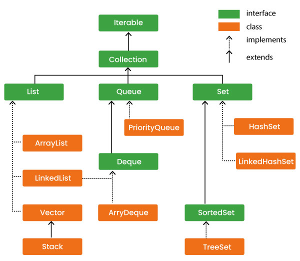

# Java Collection Framework
Collections in java serve the purpose of storing and manipulating groups of objects in a similar and unifying way.

Java's collection framework is a unified architecture for representing and manipulating collections.
Meaning if there were, say a list of user-defined objects that need some form of action, making a collection out of them would be the way to go.

Collection frameworks typically consist of **interfaces**, **implementations**, and **algorithms**.
- Interfaces are abstract data types that represent the collections themselves in the framework.
- Implementation refers to the body of the collection. It addresses the concrete way a collection is implemented. Examples are classes which are essentially re-usable data structures that serve as a blueprint for objects.
- Algorithms are methods or actions that perform useful computations, e.g: searching and sorting.
 Collection Algorithms are said to be polymorphic, i.e: they can be implemented in various ways.

The collection framework follows a certain hierarchy as seen below:

_Hierarchy of Collection Framework_

## Individual analysis of each item in the framework.
The collection framework is made up of interfaces and classes with the classes implementing the interfaces and subclasses extending the parent classes in a hierarchical format.

- **Collection Interface** is the parent interface implemented by every class in the framework. This interface declares the methods that every collection will have and is the foundation of the framework.
- **List Interface** is a child of the collection interface and lords over the ordered collection section in that every list collection implements this interface. Examples of children include: ArrayList, LinkedLists, etc.
    - ArrayList
    - LinkedList
    - Vector
        - Stack
- **Queue Interface** is a direct child of the Collection Interace
