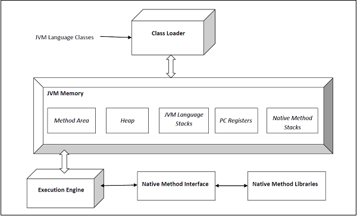

# How JVM Works
JVM stands for Java Virtual Machine, and it's purpose is to execute programs.

It is a platform-dependent specification that provides a runtime environment in which java byte code can be executed.
The JVM runs on the host's operating system and places its demands for resources from the system.

Since the JVM is a 'specification', it can have various implementations, as long as they adhere to the specifications.

The JVM takes over from the compiler in that it picks up the .class file output (also called **bytecode**) of the compiler and loads it.

- Class Loader: this section is responsible for loading, linking and initialization of the .class file.
  - Loading: The .class file is read and the corresponding binary data is generated and saved in the method area.
  After loading, the JVM also creates an object of type Class to represent this file on the **heap**.
  - Linking: This step verifies the correctness of the .class file (verification), allocates and intializes memory (preparation), and replaces symbolic references with direct references (resolution).
  - Initialization: this step assigns static variables with their values that are either defined in the code or in the **static block**.

- JVM Memory: 
  - Method Area: stores class-level information from the class loader (class names, immediate parent names, methods and variables)
  - Heap: stores information about ALL objects. It holds things like global variables since it has a long life-span and allows dynamic memory allocation.
  - Stack: this stores frames (which hold method calls). It is created anytime a thread is run.
  All local variables of a method are stored in their corresponding frame.
  In return, whenever a thread is terminated, it's stack is destroyed by the JVM as it is not a shared resource.
  - Program Counter(PC) Registers: stores the address of the current JVM instruction being executed.
  - Native Method Stack: For every thread, a new native stack is created that stores all information pertaining to that native method.

- Execution Engine: this reads the bytecode (.class file) line-by-line and uses the data and information present in various areas of memory to execute the information in the byte-code.

  It is divided into three:
  - Interpreter: reads the content of the bytecode line-by-line and then interprets it. It is slow, however, and inefficient in that when one method is called multiple times, interpretation is required everytime.
    - Just-In-Time (JIT) Compiler: takes care of the inefficiency of the interpreter. It compiles the entire byte-code into **native code** and provides direct native code interpretation for repeated method calls, thus improving efficiency.
    - Garbage Collector: cleans up unused and un-referenced objects.

## JVM Architecture

*Picture showing the JVM architecture*

## Garbage Collection
This is java's automatic process of freeing up memory.
It finds objects that are no longer in use and clears them, thereby reclaiming their memory from the heap.

Java does all of this automatically, without any user input.

Garbage collection helps greatly in providing massive performance boosts to applications and they are of different types, namely:
- Serial Collector
- Throughput Collector
- CMS Collector
- G1 Collector

