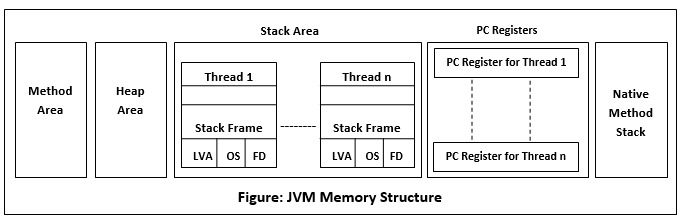

# How JVM Works
JVM stands for Java Virtual Machine, and it's purpose is to execute programs.

It is a platform-dependent specification that provides a runtime environment in which java byte code can be executed.
The JVM runs on the host's operating system and places its demands for resources from the system.

Since the JVM is a 'specification', it can have various implementations, as long as they adhere to the specifications.

The JVM takes over from the compiler in that it picks up the .class file output (also called **bytecode**) of the compiler and loads it.

- Class Loader: this section is responsible for loading, linking and initialization of the .class file.
  - Loading: The .class file is read and the corresponding binary data is generated and saved in the method area.
  After loading, the JVM also creates an object of type Class to represent this file on the **heap**.
  - Linking: This step verifies the correctness of the .class file (verification), allocates and intializes memory (preparation), and replaces symbolic references with direct references (resolution).
  - Initialization: this step assigns static variables with their values that are either defined in the code or in the **static block**.

- JVM Memory: 
  - Method Area: stores class-level information from the class loader (class names, immediate parent names, methods and variables)
  - Heap: stores information about ALL objects. It holds things like global variables since it has a long life-span and allows dynamic memory allocation.
  - Stack: this stores frames (which hold method calls). It is created anytime a thread is run.
  All local variables of a method are stored in their corresponding frame.
  In return, whenever a thread is terminated, it's stack is destroyed by the JVM as it is not a shared resource.
  - Program Counter(PC) Registers: stores the address of the current JVM instruction being executed.
  - Native Method Stack: For every thread, a new native stack is created that stores all information pertaining to that native method.

- Execution Engine: this reads the bytecode (.class file) line-by-line and uses the data and information present in various areas of memory to execute the information in the byte-code.

  It is divided into three:
  - Interpreter: reads the content of the bytecode line-by-line and then interprets it. It is slow, however, and inefficient in that when one method is called multiple times, interpretation is required everytime.
    - Just-In-Time (JIT) Compiler: takes care of the inefficiency of the interpreter. It compiles the entire byte-code into **native code** and provides direct native code interpretation for repeated method calls, thus improving efficiency.
    - Garbage Collector: cleans up unused and un-referenced objects.

- Java Native Interface (JNI): is an interface that interacts with the native method libraries (C, C++) required for execution

## JVM Architecture

*Picture showing the JVM architecture*

## Garbage Collection and Memory Management
This is java's automatic process of freeing up memory.
It finds objects that are no longer in use and clears them, thereby reclaiming their memory from the heap.
Java does all of this automatically, without any user input.

### Java Memory Structure
The JVM **defines** various run-time data areas that are used in the execution of a program.
Some of these areas are created by the JVM and some of them are created by the individual threads.
These have varying impacts on the program as areas created by the JVM will be deleted only when the JVM exits.
The areas created by threads, however, depend on the thread itself and will be deleted when the thread is exited.

_Diagram showing the Java Memory Structure_

The various parts in the Memory Structure include:
- Heap: Unlike the **stack**, the heap is a shared runtime area. There is only one heap for a JVM runtime process.
 A solid difference from the stack is that when a variable is created, the heap stores the actual object of the class while the reference to the class is pushed to the stack.
- Method Area: Here, memory allocated for class structures, method and constructor data is stored. It can either be of fixed size or can be dynamic, depending on the computer's specific configuration.
 This area of memory is shared among all the threads in a program.
- JVM Stack: The creation of a thread creates a stack in the JVM memory. It stores data and partial results needed for returning values for methods and performing dynamic linking.
 It serves the temporary memory needs of the thread and is deleted when the thread is exited.
- Native Method Stack: These are not written in java. This memory is allocated for threads when they are created for the purpose of execution, and it is called by the Java Native Interface (JNI) - A part of the JVM.
- Program Counter (PC) Registers: These are attached to every thread. They contain the address of the JVM instruction currently being executed.

### Garbage Collector
This is the feature of java that helps free up memory by deallocating object references on the heap.
The Garbage Collection process temporarily pauses all other processes to do its work and thus, is not ideal, especially in critical times when a program is needed to be up.

This problem can, however, be eliminated by applying some garbage collector algorithms. This is refered to as **Garbage Collector Tuning**.

Another solution is the addition of an age field to objects by the **generational garbage collectors**.
Consequently, as more objects are created, the list of garbage grows, thereby increasing garbage collection time and slowing programs down.

Garbage Collectors remove references that are **eligible for collection**.
This means that once an object becomes **unreachable**, it becomes eligible for collection.

There are two types of activities in garbage collection:
- Minor(Incremental) Garbage Collection: This occurs when unreachable objects in the younger generation heap are removed.
- Major(Full) Garbage Collection: This occurs when objects that survived the minor garbage collection and have been copied into the **Old or Permanent generation heap memory** are removed.
  Garbage Collection happens less frequently in the older generation when compared to the younger generation.

Programmers can request for Garbage Collection with the **System.gc()** method or the **Runtime.getRuntime().gc()** method but there is no guarantee that the JVM will respond to the request.

The former differs from the latter in that the former interacts directly with the JVM via the **System** class while the latter uses the **Runtime** class that allows the application to interface with the JVM in which the application is running.
Method chaining is then applied to access its **.gc()** method.

Garbage collection helps greatly in providing massive performance boosts to applications, and they are of different types, namely:
- Serial Collector
- Throughput Collector
- CMS Collector
- G1 Collector

Just before the garbage collector destroys an object, it invokes the **finalize()** method to perform cleanup activities.
This method can, however, be overriden for a user-defined one like closing a database connection, for example.

