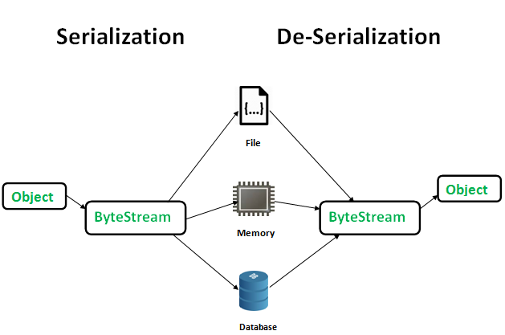

# Serialization and De-Serialization in Java
**Serialization** is the process of turning an object into a byte stream (sequence of bytes) for saving or transfer purposes.
**Deserialization** is the reverse process where byte streams are used to create an actual object in memory.

The process is platform-independent as streams that have been serialized on one computer can be de-serialized on another computer.

Serializable objects must implement the **java.io.Serializable** interface.
The **ObjectOutputStream** class exists in this package and contains a "**writeObject()**" method for serializing an object.

Similarly, the **ObjectInputStream** class also exists in this package and contains a "**readObject()**" method for de-serializing an object.

