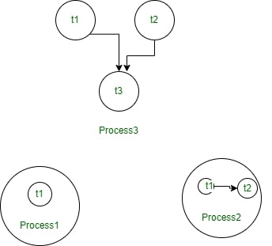

# Threading in Java

A thread is a light-weight sub-process. It is also the smallest unit of a process and has different paths of execution.
The process of deploying multiple threads is called **multi-threading** it ensures efficient use of time and resources.

_Thread in a shared memory environment in OS_

## Life cycle of threads
There are different states a thread can be in throughout the course of its life. They are as follows:
- New State: By default, a thread is in a new state. In this state, code has not yet been run and the execution process has not yet been initiated.
- Active State: When the **start()** method of a thread is invoked, it gets called into the active state.
Here, it can either be **runnable** or **running**.
    - A thread is in a **runnable** state when it is ready to run at any given time, and it is up to the thread with the slice of time preserved for the runnable threads.
    - A thread is **running** when it receives it's time slice from the scheduler, by the cpu.
- Waiting (Blocked) State: A thread is **waiting** if it is temporarily inactive. Threads in this state are typically waiting for some other task to be completed first before they can run.
- Timed Waiting State: Since the waiting period of a thread is not explicitly defined, there might be situations where the waiting time of a thread is elongated and the waiting thread is starved. In order to avoid this, the waiting period is timed, after which the **sleep()** method is called.
- Terminated State: A terminated thread means that the thread is dead and no longer available.

